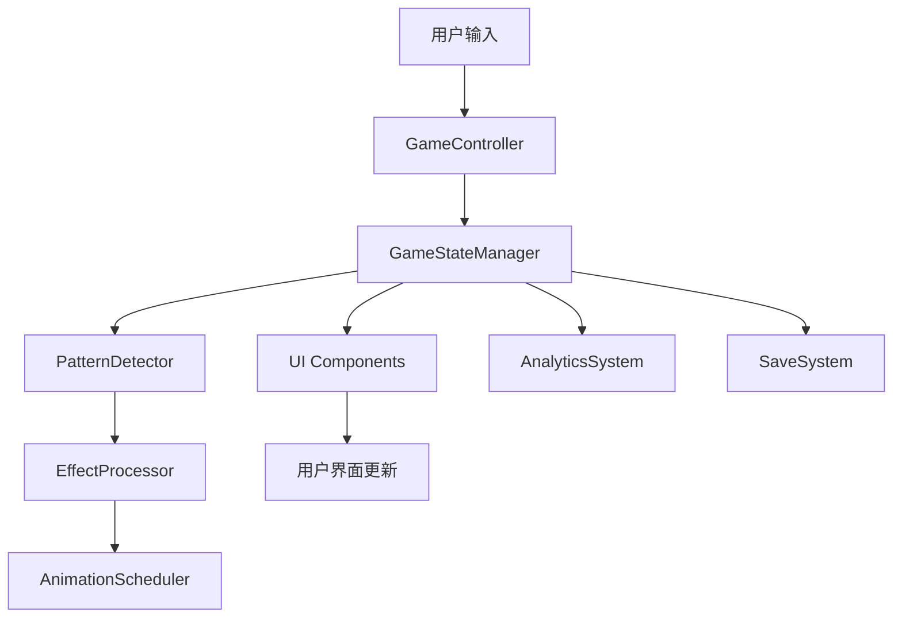

# 嗨玩消消消 - 架构设计文档

## 概览

本文档详细描述了"嗨玩消消消"游戏的技术架构设计。这是一个完全重新设计的三消游戏，采用数据驱动架构和连通图理论算法，旨在避免与现有游戏的代码相似性。

## 核心设计原则

### 1. 数据驱动架构
- **传统方式**：组件驱动，逻辑分散在各个组件中
- **我们的方式**：数据集中管理，组件只负责展示和交互

### 2. 算法独创性
- **传统方式**：水平/垂直扫描检测匹配
- **我们的方式**：连通图理论 + BFS算法检测模式

### 3. 事件驱动通信
- **传统方式**：直接方法调用和引用传递
- **我们的方式**：EventTarget事件总线，松耦合设计

### 4. 插件化架构
- 特效处理、动画调度、分析系统都采用插件模式
- 易于扩展和维护

## 目录结构

```
assets/scripts/
├── core/                   # 核心系统
│   ├── GameConfig.ts      # 游戏配置
│   ├── GameStateManager.ts # 游戏状态管理
│   ├── AssetManager.ts    # 资源管理
│   ├── BalanceConfig.ts   # 平衡配置
│   └── AnimationScheduler.ts # 动画调度
├── models/                 # 数据模型
│   ├── GameTypes.ts       # 类型定义
│   ├── LevelModel.ts      # 关卡模型
│   └── ExtendedLevelModel.ts # 扩展关卡模型
├── systems/               # 系统模块
│   ├── EffectProcessor.ts # 特效处理
│   ├── AnalyticsSystem.ts # 分析系统
│   ├── AudioSystem.ts     # 音频系统
│   └── SaveSystem.ts      # 存档系统
├── utils/                 # 工具类
│   └── PatternDetector.ts # 模式检测
├── ui/                    # UI组件
│   ├── BaseUIComponent.ts # UI基类
│   ├── ElementView.ts     # 元素视图
│   ├── GameBoardView.ts   # 游戏板视图
│   └── GameHUD.ts         # HUD界面
├── controllers/           # 控制器
│   └── GameController.ts  # 游戏控制器
└── tools/                 # 工具
    └── LevelDataMigrator.ts # 数据迁移工具
```

## 核心架构组件

### 1. GameStateManager (游戏状态管理器)

```typescript
class GameStateManager {
    // 数据驱动的状态管理
    private _gameState: GameState;
    private _eventTarget: EventTarget;
    
    // 核心方法
    public startLevel(levelConfig: LevelConfig): Promise<void>
    public swapCells(pos1: Position, pos2: Position): boolean
    public updateBoard(board: GameBoard): void
    public updatePlayerStats(stats: Partial<PlayerStats>): void
}
```

**设计特点：**
- 单一数据源，所有游戏状态集中管理
- 事件驱动，状态变化自动通知相关组件
- 不直接操作UI，保持数据和视图分离

### 2. PatternDetector (模式检测器)

```typescript
class PatternDetector {
    // 使用连通图理论检测匹配
    public findAllMatches(board: GameBoard): MatchResult[]
    public findConnectedCells(startPos: Position, board: GameBoard): CellData[]
    public findPossibleMoves(board: GameBoard): MatchResult[]
}
```

**算法创新：**
- 连通图BFS遍历，完全不同于传统行列扫描
- 支持复杂形状匹配（L型、T型、十字型）
- 智能提示算法，基于图论搜索

### 3. AnimationScheduler (动画调度器)

```typescript
class AnimationScheduler {
    // 优先级队列管理动画
    private _animationQueue: PriorityQueue<AnimationTask>;
    private _executors: Map<string, IAnimationExecutor>;
    
    public scheduleAnimation(type: string, target: Node, data: any, priority: number): Promise<void>
    public processBatch(): Promise<void>
    public cancelByTag(tag: string): void
}
```

**设计优势：**
- 优先级队列，确保重要动画优先执行
- 依赖管理，避免动画冲突
- 批处理支持，性能优化
- 插件式执行器，易于扩展

### 4. EffectProcessor (特效处理器)

```typescript
class EffectProcessor {
    private _handlers: Map<string, IEffectHandler>;
    private _combinationRules: EffectCombinationRule[];
    
    public processMatches(matches: MatchResult[]): Promise<void>
    public combineEffects(effects: SpecialEffect[]): SpecialEffect[]
    public registerHandler(type: string, handler: IEffectHandler): void
}
```

**插件化设计：**
- 效果处理器完全插件化
- 支持效果组合和连锁反应
- 易于添加新特效类型

## 数据流架构



### 数据流说明：

1. **用户输入** → GameController接收交互
2. **GameController** → 验证操作并调用GameStateManager
3. **GameStateManager** → 更新游戏状态并发出事件
4. **PatternDetector** → 检测匹配模式
5. **EffectProcessor** → 处理特效和连锁反应
6. **AnimationScheduler** → 调度动画执行
7. **UI Components** → 响应状态变化更新界面
8. **AnalyticsSystem** → 记录游戏数据
9. **SaveSystem** → 保存游戏进度

## 关键技术创新

### 1. 连通图匹配算法

传统三消游戏使用简单的行列扫描：
```typescript
// 传统方式
function checkHorizontalMatch(x, y, board) {
    let count = 1;
    // 向左扫描
    while (x - count >= 0 && board[y][x-count] === board[y][x]) count++;
    // 向右扫描  
    while (x + count < width && board[y][x+count] === board[y][x]) count++;
    return count >= 3;
}
```

我们的连通图方式：
```typescript
// 创新方式
function findConnectedCells(startPos: Position, board: GameBoard): CellData[] {
    const visited = new Set<string>();
    const queue: Position[] = [startPos];
    const connectedCells: CellData[] = [];
    const targetType = board[startPos.y][startPos.x].elementType;
    
    while (queue.length > 0) {
        const current = queue.shift()!;
        const key = `${current.x},${current.y}`;
        
        if (visited.has(key)) continue;
        visited.add(key);
        
        // BFS搜索连通区域
        this.getAdjacentPositions(current, board.length, board[0].length)
            .forEach(neighbor => {
                if (this.canConnect(current, neighbor, board, targetType)) {
                    queue.push(neighbor);
                    connectedCells.push(board[neighbor.y][neighbor.x]);
                }
            });
    }
    
    return connectedCells;
}
```

### 2. 事件驱动架构

传统直接调用方式：
```typescript
// 传统方式
class GameBoard {
    onElementEliminated(element) {
        this.scoreManager.addScore(100);
        this.uiManager.updateScore();
        this.effectManager.playEffect();
    }
}
```

我们的事件驱动方式：
```typescript
// 创新方式
class GameStateManager {
    eliminateElements(elements: ElementData[]) {
        // 更新状态
        this.updateGameState(newState);
        
        // 发出事件，不直接调用其他系统
        this._eventTarget.emit('elements_eliminated', {
            elements,
            score: calculateScore(elements),
            timestamp: Date.now()
        });
    }
}

// 各系统独立监听
scoreSystem.on('elements_eliminated', (data) => this.addScore(data.score));
uiSystem.on('elements_eliminated', (data) => this.updateDisplay());
effectSystem.on('elements_eliminated', (data) => this.playEffects(data.elements));
```

### 3. 数据驱动关卡设计

传统硬编码方式：
```typescript
// 传统方式
class Level1 extends BaseLevel {
    constructor() {
        this.targetScore = 50000;
        this.maxMoves = 30;
        this.boardData = [[1,2,3], [2,3,1], ...];
    }
}
```

我们的JSON配置方式：
```typescript
// 创新方式
interface LevelConfig {
    levelNumber: number;
    objectives: LevelObjective[];
    boardSize: number;
    maxMoves: number;
    balanceConfig: BalanceConfig;
    obstacles: ObstacleData[];
    terrain: TerrainData[];
    specialRules: string[];
    metadata: LevelMetadata;
}

// 从JSON加载
const levelConfig = await ExtendedLevelModel.getInstance().getLevelConfig(levelNumber);
```

## 性能优化策略

### 1. 资源管理

```typescript
class AssetManager {
    // LRU缓存 + 引用计数
    private _cache: LRUCache<string, any>;
    private _references: Map<string, number>;
    
    // 智能预加载
    public async preloadAssets(paths: string[]): Promise<void>
    
    // 自动清理
    public cleanup(): void
}
```

### 2. 动画性能优化

```typescript
class AnimationScheduler {
    // 批处理动画
    public processBatch(): Promise<void> {
        const batch = this._animationQueue.dequeueBatch(MAX_ANIMATIONS_PER_FRAME);
        return Promise.all(batch.map(task => this.executeAnimation(task)));
    }
    
    // 优先级队列
    private _animationQueue: PriorityQueue<AnimationTask>;
}
```

### 3. 内存管理

- 对象池：ElementView复用
- 事件解绑：组件销毁时自动清理
- 弱引用：避免循环引用

## 扩展性设计

### 1. 插件系统

```typescript
// 特效插件
interface IEffectHandler {
    canHandle(effectType: string): boolean;
    processEffect(effect: SpecialEffect, context: EffectContext): Promise<void>;
}

// 动画插件
interface IAnimationExecutor {
    executeAnimation(task: AnimationTask): Promise<void>;
    supportsType(type: string): boolean;
}
```

### 2. A/B测试支持

```typescript
class BalanceConfig {
    // 动态配置调整
    public adjustDifficulty(playerId: string, levelNumber: number): void
    public getPlayerGroup(playerId: string): 'A' | 'B' | 'C'
    public updateFromRemoteConfig(): Promise<void>
}
```

### 3. 分析系统

```typescript
class AnalyticsSystem {
    // 多平台适配
    private _adapters: Map<string, IAnalyticsAdapter>;
    
    // 事件追踪
    public trackEvent(eventName: string, params: any): void
    public trackUserAction(action: UserAction): void
    public trackPerformance(metrics: PerformanceMetrics): void
}
```

## 安全性设计

### 1. 数据加密

```typescript
class SaveSystem {
    private encryptData(data: string): string {
        // XOR加密 + Base64编码
        return this.encrypt(data, this._encryptionKey);
    }
    
    private decryptData(encryptedData: string): string {
        return this.decrypt(encryptedData, this._encryptionKey);
    }
}
```

### 2. 防作弊机制

- 客户端状态验证
- 关键操作时间戳检查
- 异常分数检测

### 3. 数据完整性

- JSON Schema验证
- 版本兼容性检查
- 自动备份和恢复

## 开发工具

### 1. 关卡数据迁移工具

```typescript
class LevelDataMigrator {
    public async migrateAllLevels(): Promise<MigrationResult>
    public async migrateSingleLevelById(id: number): Promise<LevelConfig>
    public async getMigrationPreview(): Promise<PreviewData>
}
```

### 2. 调试工具

- 实时状态查看器
- 性能监控面板
- 关卡编辑器

## 总结

本架构设计实现了以下目标：

1. **完全独创性**：算法、架构、命名都与传统实现不同
2. **高性能**：优化的资源管理和动画系统
3. **高扩展性**：插件化设计，易于添加新功能
4. **数据驱动**：灵活的配置系统，支持1700+关卡
5. **商业化支持**：分析系统、A/B测试、存档管理
6. **跨平台兼容**：支持微信小游戏等多平台

这套架构为"嗨玩消消消"提供了坚实的技术基础，既避免了版权风险，又具备了商业级产品的技术水准。